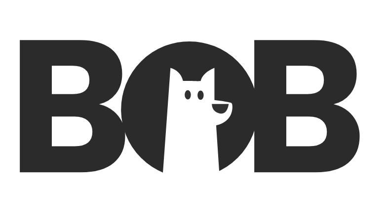

<p align="center">
    
  <h2 align="center">Bob-App [ Backend • API ]</h2>
  <p align="center">Documentation • Backend PHP </p>
</p>


## Index :

* [Introduction](#intro)
* [Installation](#install)
* [Configuration](#config)
* [API](#api)
* [Testing](#test)
* [Licence](#licence)


## Introduction <a name="intro"></a>

### About Bob

The Bob mobile app is a personal assistant offering the ability to easily create and personalize complete rental records as well as formatting them to stand out from other candidates. This is the Backend documentation for this application.

### Framework PHP :

<strong> Bob's Backend </strong>  is writed in PHP & developed with Laravel 5.
> Current Version :
```Laravel 5.7```
>

If you are not familiar with it check the [Laravel documentation](https://laravel.com/docs) or read the "About Laravel" part below.

#### About Laravel

Laravel is a web application framework with expressive, elegant syntax. We believe development must be an enjoyable and creative experience to be truly fulfilling. Laravel attempts to take the pain out of development by easing common tasks used in the majority of web projects, such as:

- [Simple, fast routing engine](https://laravel.com/docs/routing).
- [Powerful dependency injection container](https://laravel.com/docs/container).
- Multiple back-ends for [session](https://laravel.com/docs/session) and [cache](https://laravel.com/docs/cache) storage.
- Expressive, intuitive [database ORM](https://laravel.com/docs/eloquent).
- Database agnostic [schema migrations](https://laravel.com/docs/migrations).
- [Robust background job processing](https://laravel.com/docs/queues).
- [Real-time event broadcasting](https://laravel.com/docs/broadcasting).

Laravel is accessible, yet powerful, providing tools needed for large, robust applications.

## Installation <a name="install"></a>

### Server requirements :

* PHP >= 7.1.3
* PDO PHP Extension
* JSON PHP Extension

### Installating Laravel :

Clone this repository or create a new Laravel Project and transfert the folders of this repository (exept vendor), for this, follow the [Laravel documentation](https://laravel.com/docs).

And use this command : 

```
composer update
```

## Configuration : <a name="config"></a>

### DotEnv :

Laravel utilizes the DotEnv PHP library by Vance Lucas. In a fresh Laravel installation, the root directory of your application will contain a .env.example file. If you clone this repository, this file will be named .env.production, you should rename the file manually to .env. To use Bob's brackoffice you need to configure this file, to this, follow the  [documentation](https://laravel.com/docs/5.7/configuration#environment-configuration).

#### Exemple : 

```
APP_NAME=Bob-Backoffice
APP_ENV=local
APP_KEY=
APP_DEBUG=true
APP_URL=http://localhost

DB_CONNECTION=mysql
DB_HOST=127.0.0.1
DB_PORT=3306
DB_DATABASE=bob
DB_USERNAME=user
DB_PASSWORD=pswd
```

### htaccess

Laravel includes a public/.htaccess file that is used to provide URLs without the index.php front controller in the path. Before serving Laravel with Apache, be sure to enable the mod_rewrite module so the .htaccess file will be honored by the server.
If the .htaccess file that ships with Laravel does not work with your Apache installation, try this alternative:

```
Options +FollowSymLinks -Indexes
RewriteEngine On

RewriteCond %{HTTP:Authorization} .
RewriteRule .* - [E=HTTP_AUTHORIZATION:%{HTTP:Authorization}]

RewriteCond %{REQUEST_FILENAME} !-d
RewriteCond %{REQUEST_FILENAME} !-f
RewriteRule ^ index.php [L]
```

If you are using Nginx, the following directive in your site configuration will direct all requests to the index.php front controller:

```php
location / {
    try_files $uri $uri/ /index.php?$query_string;
}
```

### Files Gestions

For file management, we use Laravel management so we have to make an order for linked storage/public to public/storage.

```
php artisan storage:link
```


### Database <a name="db"></a> :

Laravel makes interacting with databases extremely simple across a variety of database backends using either raw SQL, the fluent query builder, and the Eloquent ORM. Currently, Laravel supports four databases:

* MySQL
* PostgreSQL
* SQLite
* SQL Server

Bob's backoffice use the migration system of laravel, after created and connection your database in .env, you need to use this commande : 
```
php artisan migrate --seed
```

You can check : 
* [Laravel database documentation](https://laravel.com/docs/5.7/database)
* [Eloquent ORM documentation](https://laravel.com/docs/5.7/eloquent)


## API <a name="api"></a>

Bob API has its own documentation explaining each endpoint, how they work, their specifications and possible customizations :

* [Bob API Postman Documentation](https://documenter.getpostman.com/view/5724091/RztfvWwT)

### Standard and specifications

#### REST Stantard

Bob's API is used to securely transmit data and communicate between the backend and the mobile application. The API is based on the [REST standart ](https://www.w3.org/2001/sw/wiki/REST), so it respects its features. 

#### JSON:API Specification

The API also respect the [json:api](https://jsonapi.org/) specification in order to formatting and organize data in the response of the client's request.

### Controller
The API uses the Laravel API Resource controllers system to define its endpoints through pre-defined routes as required by the REST standard, example:

| Verb | URI | Action |
| :--- | :--- | :--- |
| `GET` | `/users' | index |
| `POST` | `/users' | store |
| `GET` | `/users/{user}' | show |
| `PUT/PATCH` | `/users/{user}' | update |
| `DELETE` | `/users/{user}' | destroy |

For more information about this resource controller system, read the documentation of this system here : 
* [API Resource Controllers](https://laravel.com/docs/5.7/controllers#resource-controllers)

The API files are stored in the "API" folder itself in the "Controllers" folder :

```

Bob-php-backoffice
│ 
├── app
│   ├── Console
│   └── Exeption
│   └── Http
│   │    └── Controllers
│   │    │    └── API
│   │    │    │   └── Api files
│   │    └── Middleware
│   │    └── Resource
│   │    └── Kernel.php
│   └── Provider
│   └── Repositories
│   └── ...
├── ...
└── README.md

```

### API Resource 

Bob's API uses the Laravel Eloquent API Resource system to manage resource and collection and formatign them for response.
* [API Resources](https://laravel.com/docs/5.7/eloquent-resources)


### API Authentification

The users of the application must be able to register or to connect in order to secure the data, for that we chose a Mobile Passwordless SMS Authentication to secure and promote the user experience.

```
    USER  <-------------------------------------> BACKEND
(Mobile App)                                   (API & Database)    

                            1
                ------------------------>
                    Send phone number
                    (+33 00 00 00 00)
                                        

                            2
                <------------------------
                    Send SMS with token
                        (012345)

                            3
                ------------------------>
                    Send the token
                        (012345)

                            4
                <------------------------
                        Validation 
                    & Authentification


```
        

#### Twilio

To send an SMS from the backend backend have to use an external library. The one we chose is called Twilio. Twilio allows you to send / receive text messages and calls.

You can find twilio documentation here : [Twilio Doc](https://www.twilio.com/docs/quickstart)

#### Configuration

Install Twilio PHP library using composer: 

```
composer require twilio/sdk
```

Dotenv configuration : 

```
TWILIO_ACCOUNT_SID=SID
TWILIO_AUTH_TOKEN=TKEN
TWILIO_NUMBER=+NUMBER
```

Functions in ```app/User.php``` model :

```php
    function sendToken()

    function validateToken($token)
```

### API Securisation (Passport)

To secure the endpoints of the API and allow access only to previously authenticated users, Bob uses Passport which provides a full OAuth2 server implementation for Laravel's application. APIs typically use tokens to authenticate users and do not maintain session state between requests (Expept for the login with twilio). 
There are some actions to perform to install and configure passport to use, you can find more informations on its use and its installation on the [Passport documentation.](https://laravel.com/docs/5.7/passport)

Passport directly protects the route thanks to the **auth:api** middleware :

```php
    Route::middleware('auth:api')->group(function () {

        // ROUTES
        

    }); 
```


For this passport requires certain conditions during the request to the API, first, the header of the request must contain :

```
    Content-Type : application/json
    Accept : application/json
    Authorization : Bearer $accessToken (The token given by passport when authenticating a user)
```
Passport assign a token to users who authenticate successfully (and keep it in front):

```php
    $success['token'] =  $user->createToken('BobApp')->accessToken;
```

## Testing <a name="test"></a>

Laravel is built with testing in mind. In fact, support for testing with PHPUnit is included out of the box and a phpunit.xml file is already set up for application. The framework also ships with convenient helper methods that allow to expressively test applications.
[See more](https://laravel.com/docs/5.7/testing)

## Licence <a name="licence"></a>

MIT License

Copyright ©  2019 Axel Rayer

Permission is hereby granted, free of charge, to any person obtaining a copy
of this software and associated documentation files (the "Software"), to deal
in the Software without restriction, including without limitation the rights
to use, copy, modify, merge, publish, distribute, sublicense, and/or sell
copies of the Software, and to permit persons to whom the Software is
furnished to do so, subject to the following conditions:

The above copyright notice and this permission notice shall be included in all
copies or substantial portions of the Software.

THE SOFTWARE IS PROVIDED "AS IS", WITHOUT WARRANTY OF ANY KIND, EXPRESS OR
IMPLIED, INCLUDING BUT NOT LIMITED TO THE WARRANTIES OF MERCHANTABILITY,
FITNESS FOR A PARTICULAR PURPOSE AND NONINFRINGEMENT. IN NO EVENT SHALL THE
AUTHORS OR COPYRIGHT HOLDERS BE LIABLE FOR ANY CLAIM, DAMAGES OR OTHER
LIABILITY, WHETHER IN AN ACTION OF CONTRACT, TORT OR OTHERWISE, ARISING FROM,
OUT OF OR IN CONNECTION WITH THE SOFTWARE OR THE USE OR OTHER DEALINGS IN THE
SOFTWARE.


